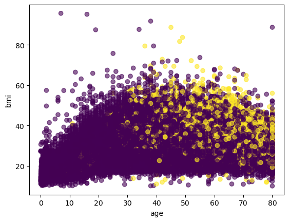
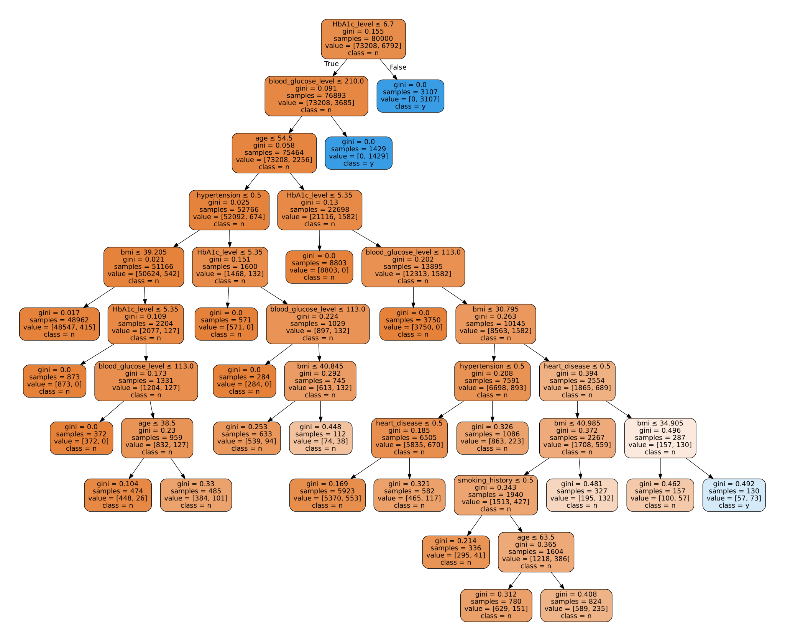

# ATIVIDADE PRÁTICA – K-MEANS

O k-means é um tipo de algoritmo de aprendizado de máquina não supervisionado que agrupa os dados com base em suas características. Neste caso, é usado para criar dois grupos (ou 'clusters') de pacientes, na tentativa de distinguir entre aqueles que têm diabetes e aqueles que não têm. No entanto, como os resultados mostram, a árvore de decisão, que é um algoritmo de aprendizado de máquina supervisionado, foi capaz de alcançar um desempenho significativamente melhor nesta tarefa.

## Table of Contents

1. [Introdução](#introduction)
2. [Dados](#data)
3. [Metodologia](#methodology)
4. [Resultados](#results)


## Dados

Os dados contêm várias variáveis de entrada, incluindo gênero, idade, hipertensão, doença cardíaca, histórico de tabagismo, Índice de Massa Corporal (BMI), nível de Hemoglobina Glicada (HbA1c), e nível de glicose no sangue. A variável de saída, ou alvo, é 'diabetes', indicando se o paciente tem ou não diabetes.

Os dados foram obtidos do Kaggle: [https://www.kaggle.com/datasets/iammustafatz/diabetes-prediction-dataset](https://www.kaggle.com/datasets/iammustafatz/diabetes-prediction-dataset)

1. **gender**: Este é o gênero do paciente, que pode ser masculino ou feminino.

2. **age**: Esta é a idade do paciente, em anos.

3. **hypertension**: Esta é uma indicação de se o paciente tem hipertensão ou não. "1" indica que o paciente tem hipertensão e "0" indica que o paciente não tem hipertensão.

4. **heart_disease**: Esta é uma indicação de se o paciente tem doença cardíaca ou não. "1" indica que o paciente tem doença cardíaca e "0" indica que o paciente não tem doença cardíaca.

5. **smoking_history**: Esta coluna detalha o histórico de tabagismo do paciente. As opções incluem "never" (nunca), "current" (atualmente é fumante) e "No Info" (sem informação).

6. **bmi**: Esta é a medida do Índice de Massa Corporal do paciente.

7. **HbA1c_level**: Esta é a medida do nível de Hemoglobina Glicada (HbA1c) do paciente, um indicador importante do controle de glicose a longo prazo.

8. **blood_glucose_level**: Este é o nível de glicose no sangue do paciente.

9. **diabetes**: Esta é a variável de destino que estamos tentando prever. "1" indica que o paciente tem diabetes e "0" indica que o paciente não tem diabetes.



Podemos ver que há algumas colunas que são do tipo object, que significa que são variáveis categóricas, como 'gender', 'smoking_history'. Uma árvore de decisão pode lidar com variáveis categóricas diretamente, mas para facilitar a implementação em Python, vamos usar o LabelEncoder para codificar essas variáveis para valores numéricos.

### Visualização dos dados

| gender | age | hypertension | heart_disease | smoking_history | bmi | HbA1c_level | blood_glucose_level | diabetes |
|--------|-----|--------------|---------------|-----------------|-----|-------------|---------------------|----------|
| Female | 80.0| 0 | 1 | never | 25.19 | 6.6 | 140 | 0 |
| Female | 54.0| 0 | 0 | No Info | 27.32 | 6.6 | 80 | 0 |
| Male | 28.0| 0 | 0 | never | 27.32 | 5.7 | 158 | 0 |
| ... | ...| ... | ... | ... | ... | ... | ... | ... |


#### Gráfico da árvore de decisão



## Referências

```py
@article{scikit-learn,
  title={Scikit-learn: Machine Learning in {P}ython},
  author={Pedregosa, F. and Varoquaux, G. and Gramfort, A. and Michel, V.
         and Thirion, B. and Grisel, O. and Blondel, M. and Prettenhofer, P.
         and Weiss, R. and Dubourg, V. and Vanderplas, J. and Passos, A. and
         Cournapeau, D. and Brucher, M. and Perrot, M. and Duchesnay, E.},
  journal={Journal of Machine Learning Research},
  volume={12},
  pages={2825--2830},
  year={2011}
}

@misc{kaggleDiabetesPrediction,
    author={MOHAMMED MUSTAFÁ},
    title={Diabetes prediction dataset - kaggle.com},
    url={https://www.kaggle.com/datasets/iammustafatz/diabetes-prediction-dataset},
    journal={Kaggle},
    note={[Accessed 27-May-2023]},
}
```